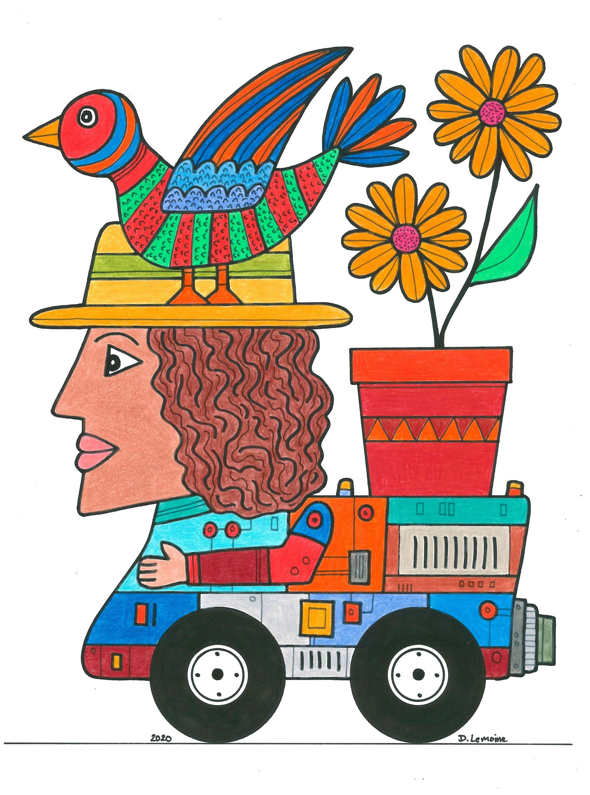
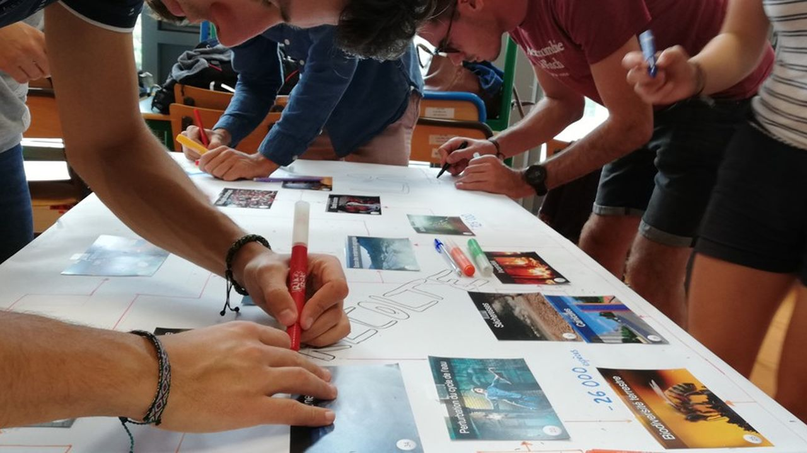
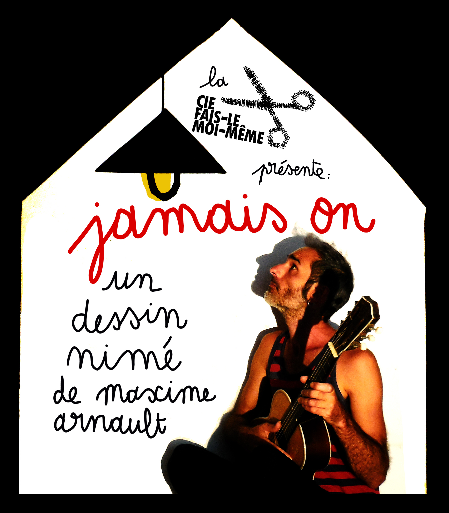
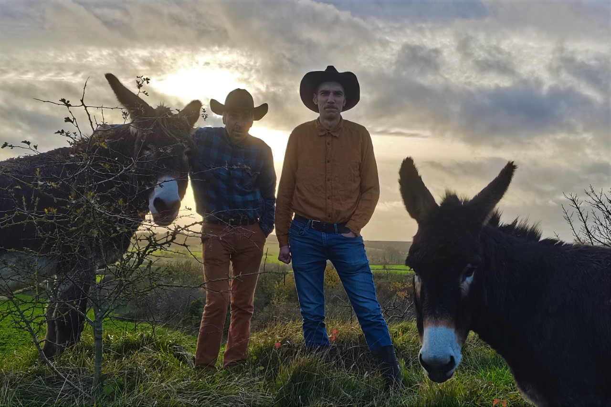

# _Des Palettes Plein Les Yeux_ 

C'est le nouveau festival de la rentrée à Longvilliers.
Et c'est sa toute première édition!

Au cœur du nouveau tiers-lieu, La Palette, 
on vous concocte un week-end bucolique avec une programmation culturelle riche et fun, 
faite de spectacles, de concerts, d'impromptus, d'ateliers, d'exposition...

Vous trouverez aussi un espace de bar et restauration où vous pourrez déguster les bières de la brasserie de La Palette.

# Pour accéder à la billetterie, [c'est ici !](https://www.helloasso.com/associations/association-pour-la-palette/evenements/billetterie-des-palettes-plein-les-yeux)

### _Tout le week-end en continu_ :  

* **Bar** (où sera servi ma Tante Claire, la bière de la Palette!!)  
et **Restauration** sur place

* Stands :  
  - Librairie éphémère "Fenêtres sur livres"
  - Chocolats fabriqués à Longvilliers "Campagnes et Chocolats"
  - Jeux en bois

* Exposition de l'artiste Dominique Lemoine 

## **Samedi 30 septembre**

### 13h30 : Ouverture des portes

### 14h30 : Atelier Arts Plastiques avec Catherine Slowick autour de l'exposition de Dominique Lemoine (gratuit)  
De 3 ans à 8 ans (accompagné d'un adulte)  

### 16h : _GlounTéko_ - Compagnie Cirque Inachevé 
Tout public à partir de 5 ans - 7€ / 5€

GlounTéko est un personnage aux allures de Charlie Chaplin avec un bancal de monde dans le corps.  
Chez lui tout s’emmêle et tout s’échappe, et lorsque ses objets, son corps ou sa langue commencent à lui jouer des tours, son spectacle prend l'allure d'un beau bordel à déficeler. Mais derrière son apparente naïveté, la virtuosité n'est jamais bien loin.  
Avec une gestuelle s’approchant parfois du mime,parfois de la danse et que parfois on ne sait plus trop, il offre un jeu de situation dans lequel il se révèle jongleur, danseur et bluesman. A son insu il devient clown, laissant apparaître une poésie de l’absurde où la renverse se logique et les zygomatiques se relèvent.

<iframe width="1079" height="607" src="https://www.youtube.com/embed/pJr5Rt6gNfk" title="Teaser GlounTéKo" frameborder="0" allow="accelerometer; autoplay; clipboard-write; encrypted-media; gyroscope; picture-in-picture; web-share" allowfullscreen></iframe>

### 18h : _Les Enfants de La Destinée_ - Cie Fais-Le Moi-Même 
Tout public, à partir de 10 ans - 7€ / 5€

C’est un spectacle qui s’adresse à ceux qui ne sont plus des enfants, pour leur proposer de regarder derrière eux. Demandons nous si on a tenu les promesses de nos ambitions naïves.  
Et pour questionner nos destinées, on convoque des histoires vraies. Celles de quatre femmes, toutes musiciennes, qui avaient des rêves qu’elles n’ont pas atteint, des destins contrariés, des accidents de parcours. Mais toutes ont su, à leurs manières, faire un saut de biche au dessus des croche-pieds.  
C’est une galerie de portraits : on va vous parler de ce petit panthéon qu’on punaise sur les murs de nos chambres de grands enfants pour nous donner envie de croire en quelque chose.  
Et tout ça se fait avec un rétro-projecteur d’antan, une guitare électrique, une paire de ciseaux, un écran blanc et 2 ampoules.

<iframe width="1079" height="607" src="https://www.youtube.com/embed/O2ERxNmiDUI" title="Les Enfants de la Destinée : Cie Fais Le Moi Même" frameborder="0" allow="accelerometer; autoplay; clipboard-write; encrypted-media; gyroscope; picture-in-picture; web-share" allowfullscreen></iframe>

### 20h : Concert : _La Bête_ (gratuit)

Trio hybride, venu tout droit d’un Calais-monde dont elles sont empreintes,  
La Bête rugit.  
Guitaristes, bassistes, beatmakeuses, accordéonistes, banjoïstes, chanteuses, elles explorent leur palette musicale cosmopolite et populaire, aux sonorités rock, traditionnelles et électroniques. Elles mêlent accidentel humain et pulsations trip-hop.  
Les textes chantés à trois voix parlent d’elles, d’autres, de nous, parfois. Elles exaltent leur puissance, cassent des codes, brandissant leurs utopies réelles et inclusives, le poing levé.

<iframe width="1079" height="607" src="https://www.youtube.com/embed/7qLA2gkqCNg" title="Au Coeur de la Bête (live session)" frameborder="0" allow="accelerometer; autoplay; clipboard-write; encrypted-media; gyroscope; picture-in-picture; web-share" allowfullscreen></iframe>

## Dimanche 1er octobre

### 10h : _Fresque du climat_ Gratuit

  
Atelier d’intelligence collective à destination des adultes pour comprendre les causes et conséquences du changement climatique.  
Plus d'infos [ici](https://association.climatefresk.org/training_sessions/6b4a2aed-19b8-45d3-931e-3224c6647682/show_public?language=fr&tenant_token=36bd2274d3982262c0021755)  
A partir de 14 ans. 
Durée 3h

### 11h : _Jamais On_ - Cie Fais-Le Moi-Même 
Jeune public, à partir de 3 ans - 5€

A travers ce deuxième spectacle de la _Cie Fais-Le Moi-Même_, Maxime Arnault continue d'interroger son thème de prédilection, la maison.  
Avec ce "dessin nimé" musical, pop et gribouillé, Maxime, tour à tour, dessinateur, chanteur, marionnettiste ou bricoleur, prouve qu'avec trois bouts de ficelle il est possible de créer des images fortes et poétiques.  
_Jamais On_ ravira, entre autres, les amateurs de rétroprojecteur, de papier découpé, des Beatles, de ciel étoilé, de cassette audio, de pop japonaise et d'Evelyne Dhéliat.

### 11h30 : _Le Bureau Détimbré_ - Cie L'Arrêt Création (gratuit)

.jpg)

Messages d’amour ou d’amitié, insolites ou poétiques, déclarations publiques ou formats plus intimistes, le public qui le souhaite est invité, chacun leur tour, à confier leurs mots doux et leurs pensées aux factrices et facteurs du Bureau Détimbré !

Avec bagou et gaîté, les membres du Bureau Détimbré chercheront parmi les personnes présentes sur les lieux, l’être cher.e qui aura été choisi pour créer la surprise et délivrer leur message dans un impromptu artistique.

 
### 11h30 : Atelier Arts Plastiques avec Catherine Slowick autour de l'exposition de Dominique Lemoine (gratuit)  
De 3 ans à 8 ans (accompagné d'un adulte)  

## Bar et restauration sur place  

### 14h : Concert pour toute la famille : _Les Frères Wall & Gain_ (gratuit)

La musique adoucit les mœurs : la preuve.  
Les frères Wall&Gain chantent depuis longtemps dans une pure tradition américaine appelée Hillbilly (traduire : “les idiots du village”).  
Avant, ils étaient bêtes et méchants.  
Maintenant ils sont juste bêtes.  
Émotions, chapeaux, banjo, poule, fourchette, petit cœur.  
Pour toute la famille.

### 16h : Concert : _Feu Minéral_ (gratuit)

Délicat et absorbant, le duo francophone Feu Minéral agit comme stabilisateur émotionnel, autour d'une folk pop aérée libérant la place aux mots coécrits et portés par les voix d'Anaïs Delmoitiez et Benoît Bourgeois.  
Deux voix interrogeant les pensées, démêlant la confusion des sentiments, recherchant l'harmonie et intensifiant les états de l'âme lorsqu'elles raisonnent à l'unisson.  
Dans cette époque contrainte par le repli sur soi, l'urgence et la fulgurance de la rencontre de ces deux artistes marqués au fer rouge poussent les auditeurs à se tourner vers le large.  
Un voyage main dans la main pour se libérer du passé et progresser ensemble vers un chemin plus sûr, léger, où tombent les inhibitions, dans une croyance profonde en l'être humain et l'avenir.  
Un shoot de poésie, d'amour en perspective !

Feu Minéral, c'est pop, c'est folk, ça pleure, ça rit, ça chante, ça vit !

<iframe width="1079" height="607" src="https://www.youtube.com/embed/SyWdbRG9DRk" title="Feu Minéral - Le Clip (Officiel) #popfolk #frenchpop #pasdecalais" frameborder="0" allow="accelerometer; autoplay; clipboard-write; encrypted-media; gyroscope; picture-in-picture; web-share" allowfullscreen></iframe> 